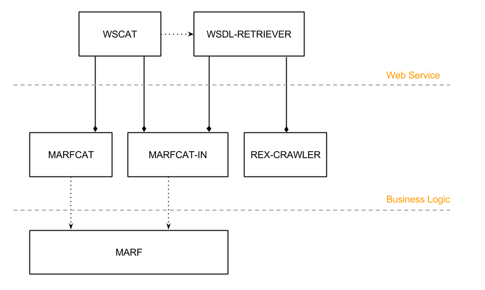

WSCat
========

Web Service Categorization Service
--------

### Description
This is a research project that has to do writing a client and service to gauge other services from a repository or set of repositories (e.g., by crawling for WSDLs, WADLs, UDDIs, RDFs) and then using a classier, such as MARF, to categorize the services (e.g., by the service type, or industry)

### Design
WSCat is a composition of two services:
 * **WSCat** is the main service that expose the method requested in the project's outline.
 * **WSDLRetirever** is the backbone service used to crawl and parse WSDLs used in the MARFCAT-IN.xml file.
This service aims to use the MARF semantic capabilities to offer WSDL classification. The following diagram illustrates a generic overview of the system, representing the main WSCat's components:

### Documentation
This project provides a brief [description](README.md) of this system and its functionalities. Additionally, the appropriate Javadoc documentation can be generate with `make doc`.

### Services
The restful services are available at the following URL:
 * http://localhost:8080/WSCat/api/categories/
 * http://localhost:8080/WSCat/api/files/
 * http://localhost:8080/WSCat/api/logs/

### User cases
 1. Submit an URL locating a WSDL for classification.
 2. Submit an URL locating a list of WSDLs to include in the dataset.

### Variations
During the implementation of this project, we opted to integrate or skip some of the specifications in the assignments. This section explains our motivations for changing or diverging from the original requirements.

 * According to PM1, the crawler should be able to parse the WSDL in order to grab its description. We adopted this solution since it is independent from the web site submited.
 * Alternatively to the general solution, `WSDLRetriever` has a custom parser which target 'programmableweb'. Having an ad-hoc parse allows us to retrieve WSDLs that match a **single word** category.
 * The crawler meets the basic requirements, but we detach it as a sub-module documented [here](https://github.com/shake0/RexCrawler). This framework allows to deploy custom parsers on multithreaded crawling system.
